<h1 align="center">
	⚡ SnapFlow
</h1>

<h3 align="center">
	Modern Snaptube-Style UI Media Downloader powered by yt-dlp for Android
</h3>

<h4 align="center">
	Redesigned &amp; Maintained by <b><a href="https://github.com/dev-abuhurairah">dev-abuhurairah</a></b> <br>
	<i>(Core download engine based on YTDLnis by Denis Çerri)</i>
</h4>

<div align="center">

[](#-automated-apk-compilation-via-github-actions)
[](https://www.gnu.org/licenses/gpl-3.0)
[](https://github.com/dev-abuhurairah)

</div>

---

## 🌟 What is SnapFlow?

**SnapFlow** combines the power and stability of `yt-dlp` with the iconic, clean, and modern UI/UX of **Snaptube**:
- 🎨 **Signature Snaptube Aesthetic:** Vibrant warm yellow accents (`#FFB800`), deep matte dark background (`#121212`), rounded cards, and category tabs.
- 📱 **Floating Format Selector:** Non-full-width floating card dialog for downloading videos and audio with clear format and file size badges.
- 🚀 **Zero-Touch Core Engine:** 100% of the internal `yt-dlp` download logic, services, database, and background workers remain strictly preserved to guarantee zero regressions or bugs.
- ⚡ **Silky Smooth Animations:** Launch transition with logo pulse/scale reveal.
- 🤖 **Zero-Setup GitHub Actions CI:** Build and download signed APKs directly from GitHub without needing Android Studio installed locally!

---

## 🛠️ Automated APK Compilation (Via GitHub Actions)

No Android Studio? No problem! SnapFlow comes with a preconfigured CI/CD workflow:
1. **Push or Fork** this repository to your GitHub account (`https://github.com/dev-abuhurairah/SnapFlow`).
2. Go to the **Actions** tab in your repository.
3. Click on **Android CI** and click **Run workflow** (or simply push any commit).
4. GitHub will automatically compile the APKs (`arm64-v8a`, `armeabi-v7a`, `universal`, etc.).
5. Download the `.apk` from the **Artifacts** section at the bottom of the run, and install it on your device!

---

## 💡 Features:

- Download audio/video files from more than <a href="https://github.com/yt-dlp/yt-dlp/blob/master/supportedsites.md">1000 websites</a>
- Process playlists
	- Edit every playlist item separately just like in a normal download item
	- Select a common format for all items and/or select multiple audio formats in case you are downloading them as a video
	- Select a download path for all items
	- Select a filename template for all items
	- Batch update download type to audio/video/custom command in one click
- Queue downloads and schedule them by date and time
	- You can also schedule multiple items at the same time
- Download multiple items at the same time
- Use custom commands and templates or use yt-dlp with the built-in terminal
	- You can backup and restore templates so you can share them with your buddies
- Supports cookies. Log in with your accounts and download private/unavailable videos, unlock premium formats etc.
- Cut videos based on timestamps and video chapters (experimental yt-dlp feature)
	- You can make unlimited cuts
- Remove SponsorBlock elements from downloaded items
	- Embed them as a chapters in your video 
- Embed subtitles/metadata/chapters etc
- Modify metadata such as title and author
- Split item into separate files depending on its chapters
- Select different download formats
- Bottom card right from the share menu, no need to open the app 
	- You can create a txt file and fill it with links/playlists/search queries separate by a new line and the app will process them
- Search or insert a link from the app
	- You can stack searches so you can process them at the same time
- Log downloads in case of problems
- Re-download cancelled or failed downloads
	- You can use gestures to swipe left to redownload and right to delete
	- You can long click the redownload button in the details sheet to show the download card for more functionality
- Incognito mode when you don't want to save a download history or logs
- Quick download mode
	- Download immediately without having to wait for data to process. Turn off the bottom card and it will instantly start
- Open / share downloaded files right from the finished notification
- Most yt-dlp features are implemented, suggestions are welcome
- Material You interface
- Theming options
- Backup and restore features
- MVVM architecture with WorkManager

## 🧩 Plugin Support

YTDLnis orchestrates plugins so users can freely upgrade and downgrade components such as:
- Python
- JS Runtimes (NodeJS, Deno)
- FFmpeg
- Aria2c

You can install ytdlnis packages from this repository [ytdlnis-packages](https://github.com/deniscerri/ytdlnis-packages/) or through the updating section in the application.
<br>For more information refer to the repo's README.

## 📲 Screenshots

<div>
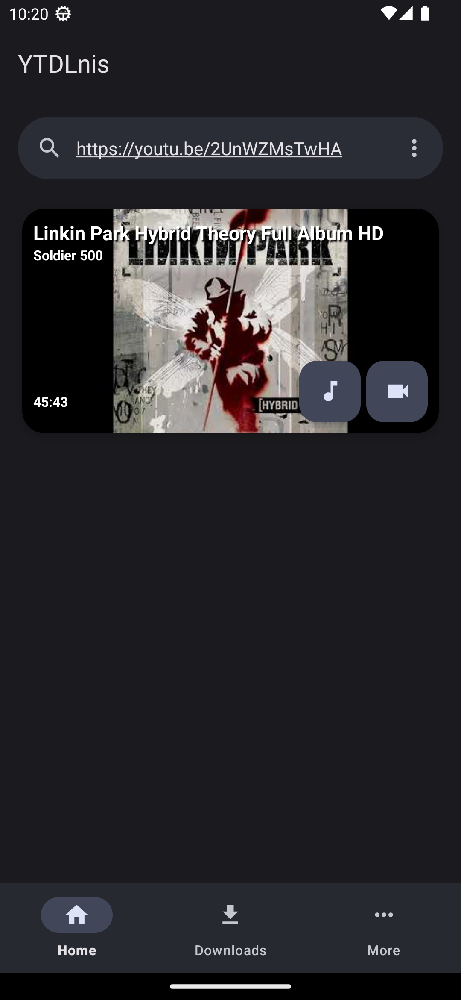
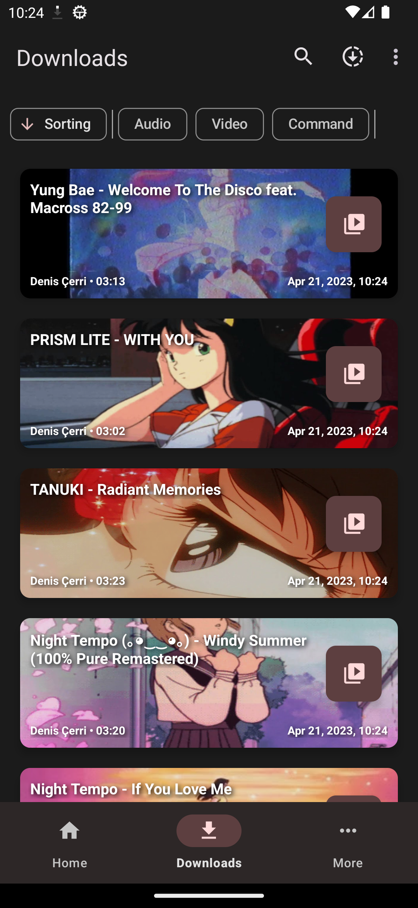
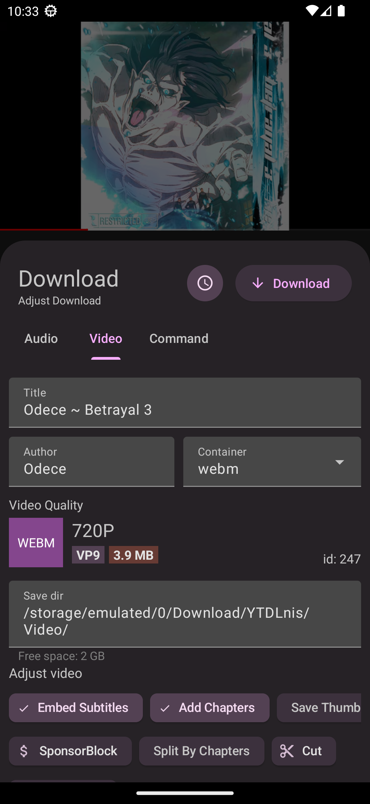
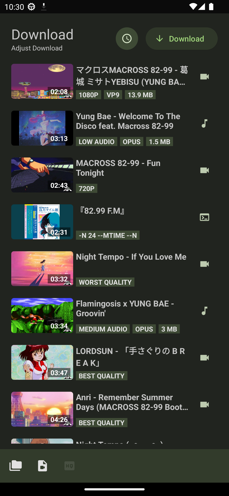
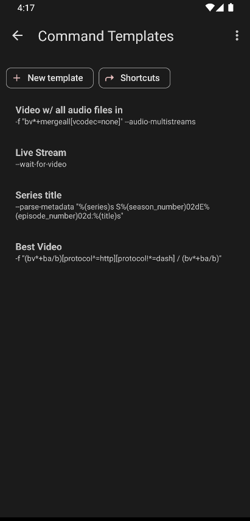
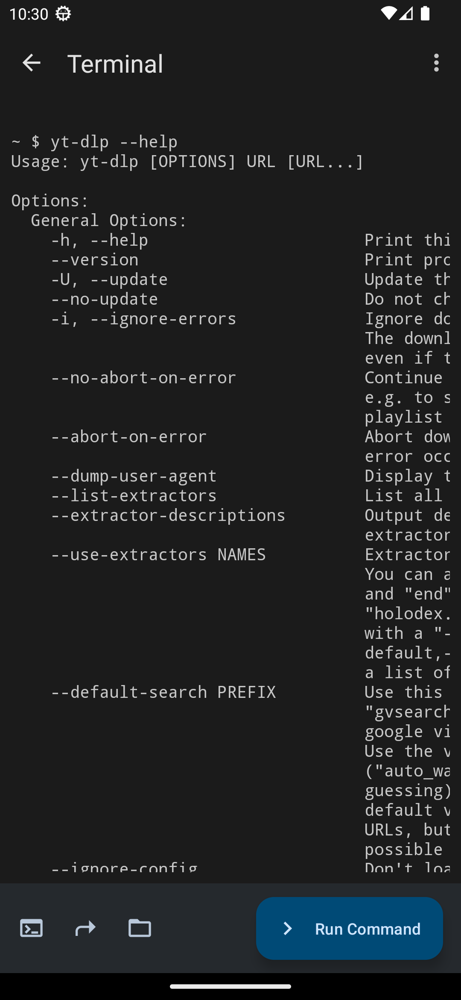
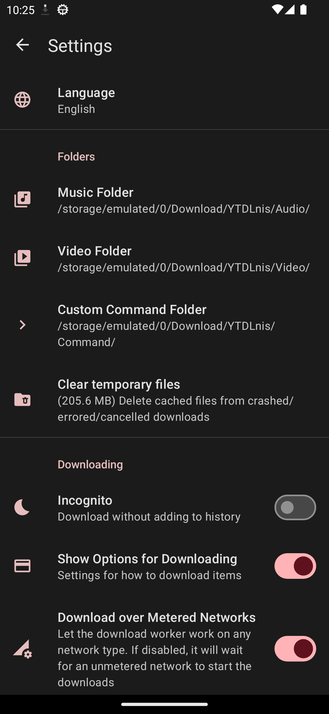
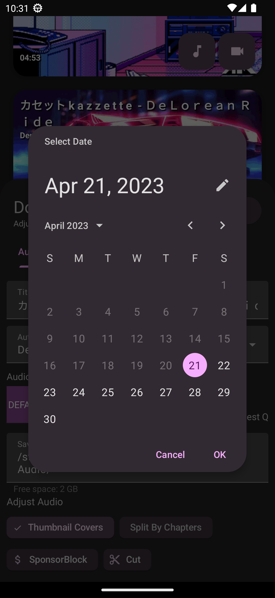
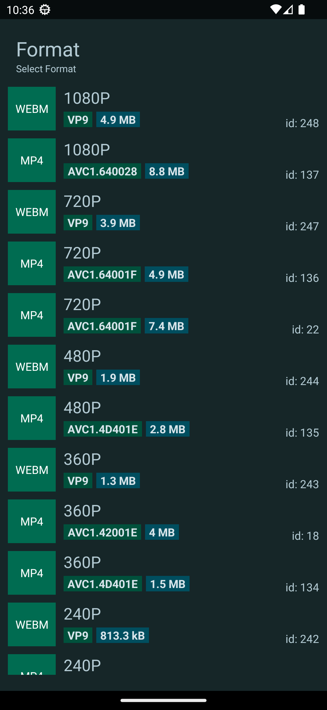
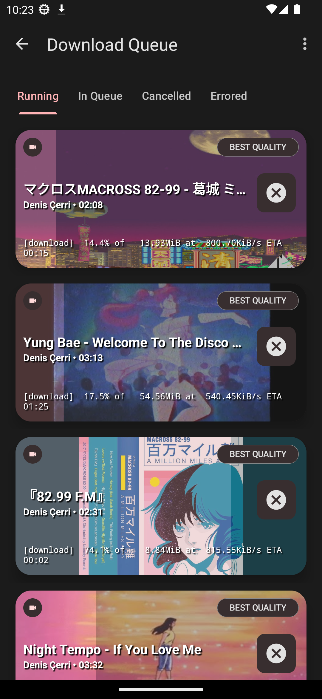
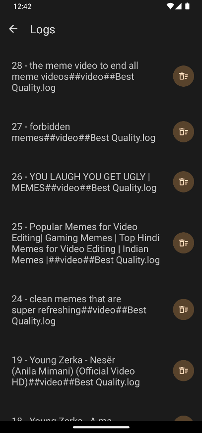
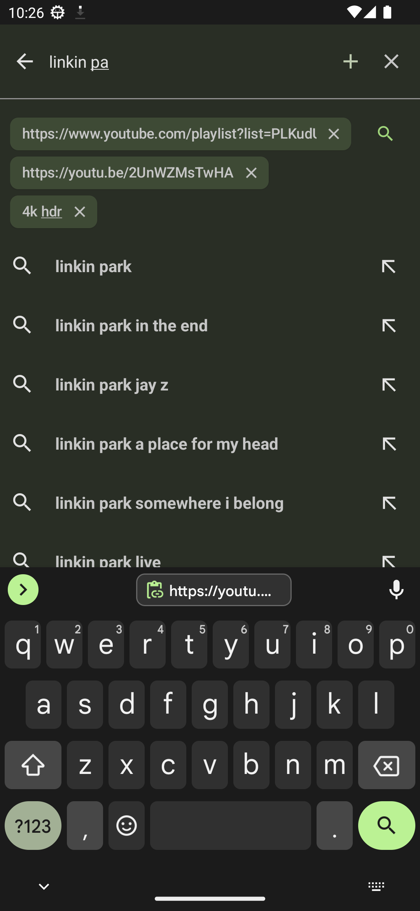
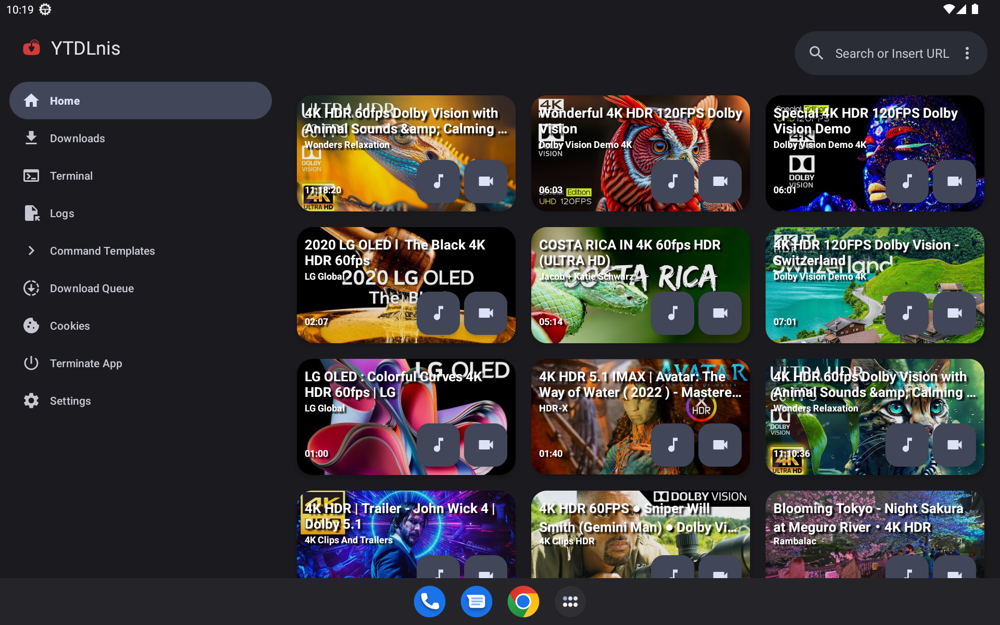
</div>

## 💬 Contact

Join our [Discord](https://discord.gg/WW3KYWxAPm) or [Telegram channel](https://t.me/ytdlnis) for announcements, discussion and releases.

## 😇 Contributing

Please read the [contributing](CONTRIBUTING.MD) section if you would like to contribute.

## 📝 Help translate on Weblate
<a href="https://hosted.weblate.org/engage/ytdlnis/">

</a>


<a href="https://hosted.weblate.org/engage/ytdlnis/">

</a>

## 🔑 Connect with third-party apps using the package name

The app's package name is "com.deniscerri.ytdl".

## 🔍 Verify application signature

The app should contain the signature below. The github workflow action uses it, and the releases are based on it to make it a reproducible build.
If the signature is different, your third party distributor has modified the application. Please use the app with the original signature.
```
Signer #1 certificate DN: CN=Denis Cerri, OU=Personal, O=Personal, L=Albania, ST=Albania, C=AL
Signer #1 certificate SHA-256 digest: 263645cb5272eb290759fe1f59149ae24df6ce171e9f6666eead981d3fc64c95
Signer #1 certificate SHA-1 digest: 2fec9c2fcef68d29a60857e185c795fec5f56fb6
Signer #1 certificate MD5 digest: 429d0c6315d2f99650f66cc44cf5a794
```


## 🤖 Connect with third-party apps using intents

You can use intents to push commands to the app to run downloads without user interaction.
Accepted variables:

<b>TYPE</b> -> it can be: audio,video,command <br/>
<b>BACKGROUND</b> -> it can be: true,false. If its true the app won't show the download card no matter what and run the download in the background <br/>

### An example of downloading an audio item in the background with Tasker
1. Create Send Intent task
2. Action: android.intent.action.SEND
3. Cat: Default
4. Mime Type: text/*
5. Extra: android.intent.extra.TEXT:url (instead of "url" write the URL of the video you want to download)
6. Extra: TYPE:audio
7. Extra: BACKGROUND:true

## 📄 License

[GNU GPL v3.0](https://github.com/deniscerri/ytdlnis/blob/main/LICENSE)

Except for the source code licensed under the GPLv3 license, all other parties are prohibited from using the "YTDLnis" name as a downloader app, and the same is true for its derivatives. Derivatives include but are not limited to forks and unofficial builds.

## 😁 Donate


[](https://www.buymeacoffee.com/deniscerri)

## 🙏 Thanks

- [decipher3114](https://github.com/decipher3114) for the app's icon
- [dvd](https://github.com/yausername/dvd) for being an example youtubedl-android implementation
- [seal](https://github.com/JunkFood02/Seal) for certain design elements and features I wanted to have in this app when I started developing it
- [youtubedl-android](https://github.com/yausername/youtubedl-android) for porting yt-dlp to Android
- [yt-dlp](https://github.com/yt-dlp/yt-dlp) and its contributors for making this tool possible. Without it this app wouldn't exist


and to a lot of other people, such as contributors.
